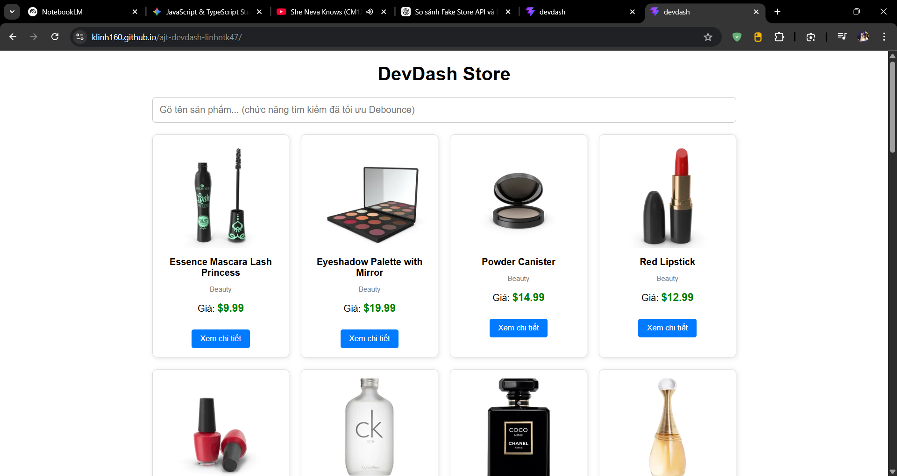
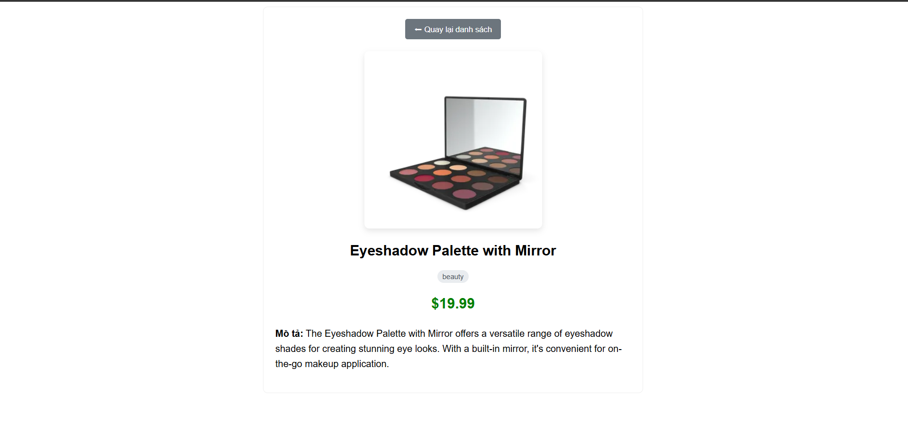

# DevDash - Typed Async Dashboard

## Mô tả
DevDash là một trang web hiển thị danh sách sản phẩm lấy từ DummyJSON API. Dự án được xây dựng bằng TypeScript và Vite, tập trung vào việc xử lý dữ liệu bất đồng bộ (async/await), an toàn kiểu dữ liệu (type-safe) và cấu trúc module sạch sẽ.

## Demo
👉 **Link xem thực tế:** https://klinh160.github.io/ajt-devdash-linhntk47/

## Hướng dẫn chạy ở máy
1. Mở terminal và chạy lệnh tải thư viện: `npm install`
2. Chạy server phát triển: `npm run dev`
3. Mở trình duyệt ở địa chỉ `http://localhost:5173`

## Danh sách tính năng đã hoàn thành

### Pass Tier
- [x] Dự án biên dịch không lỗi với `"strict": true`.
- [x] Dữ liệu được định nghĩa bằng `interface` (không dùng `any`).
- [x] Tải và hiển thị danh sách dùng `async/await`.
- [x] Hiển thị rõ các trạng thái loading/success/error.
- [x] Có trang xem chi tiết sản phẩm theo ID.

### Good Tier
- [x] Tìm kiếm và lọc bằng Higher-Order Functions (`filter`).
- [x] Hàm lấy dữ liệu tái sử dụng `fetchJson<T>` (Generic).
- [x] Tải song song danh sách và danh mục bằng `Promise.all`.

### Excellent Tier
- [x] Quản lý trạng thái bằng **Discriminated union** (`AppState`).
- [x] Sử dụng **Utility types** (`Pick` cho DTO).
- [x] Tối ưu ô tìm kiếm bằng **Debounce** (Closure).
- [x] Kiến trúc chia Module rõ ràng (`api.ts`, `types.ts`, `ui.ts`, `state.ts`).

## Ảnh chụp màn hình

